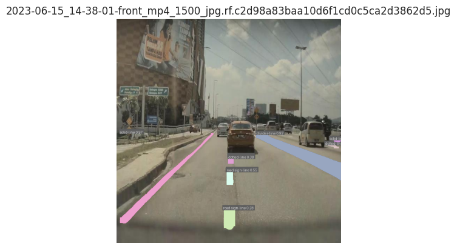
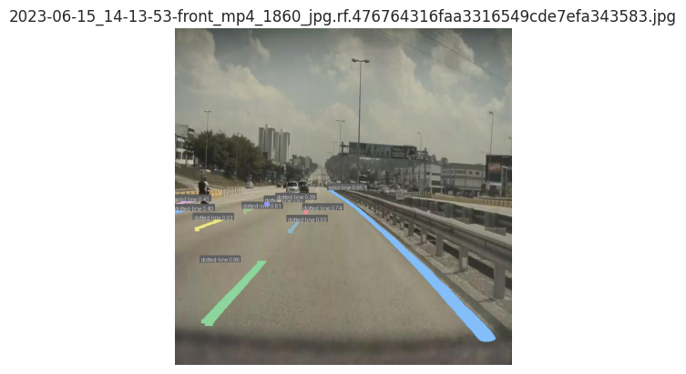
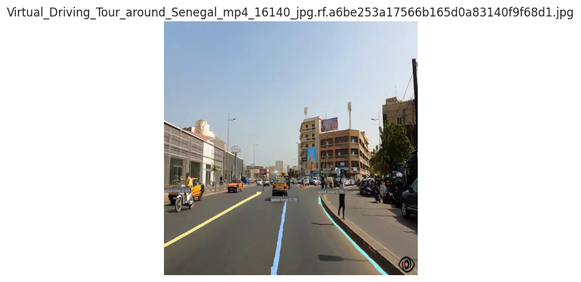
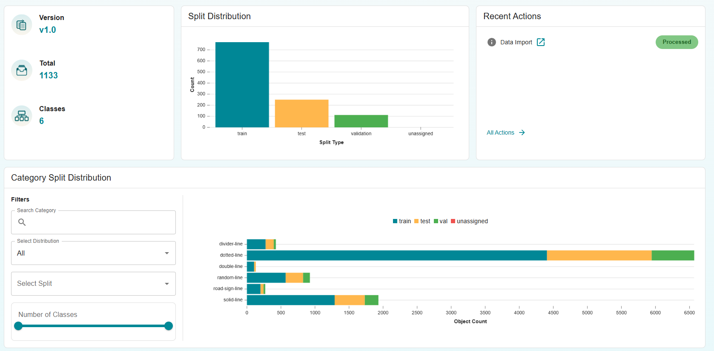
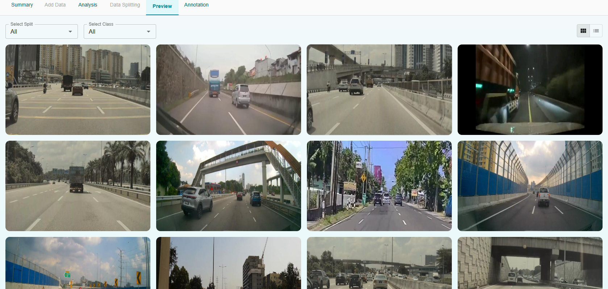
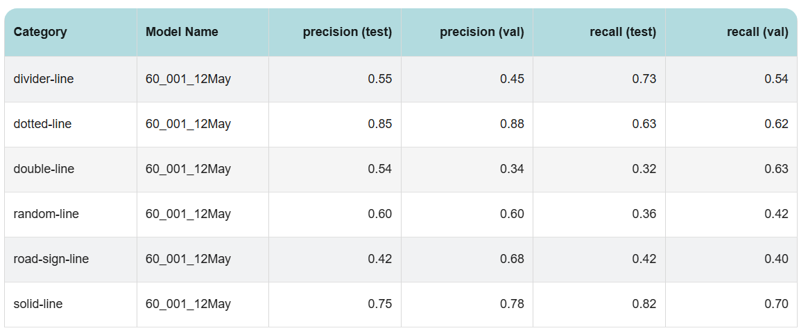
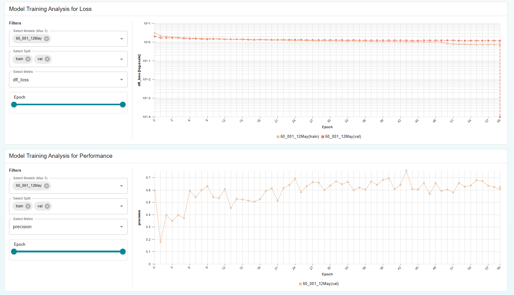
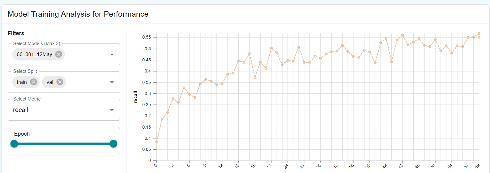
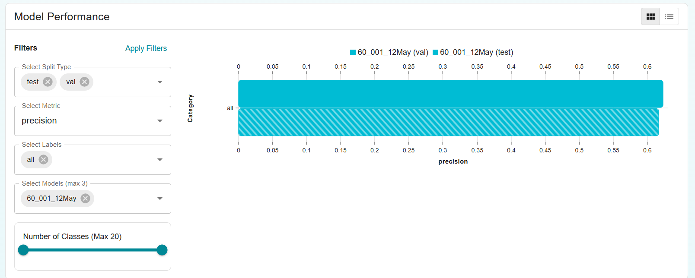

<meta title="Road Lane Instance Segmentation"
      description="Discover how instance segmentation enables precise road lane understanding for autonomous vehicles using Matrice's no-code computer vision platform.">
<meta name="keywords" content="Matrice AI, instance segmentation, lane detection, road safety, autonomous vehicles, ADAS, YOLOv8, model training, dataset annotation, no-code AI, real-time perception, computer vision, model deployment, model inference">

# Smarter Roads with AI: Road Lane Instance Segmentation using [Matrice](https://matrice.ai)

AI is reshaping how vehicles understand roads. While classification tells us **what** is in an image, and detection tells us **where**, **image segmentation** goes a step further—labeling **every pixel**. This allows systems to not only detect lanes, but to distinguish and **segment each lane individually**—a leap toward more precise autonomy.

This guide walks through building a road lane **instance segmentation** model using [Matrice](https://matrice.ai), a no-code computer vision platform that simplifies every step—from dataset upload to deployment.

---

## Why Instance Segmentation for Lane Detection?

Unlike traditional lane detection, instance segmentation offers pixel-level precision, allowing:

- Clear differentiation between overlapping or adjacent lanes  
- Accurate modeling of curved, dashed, or irregular lane types  
- Better decision-making for ADAS and autonomous driving

Matrice’s YOLOv8 Instance Segmentation Nano model enables all this with just 3.4 million parameters—fast and lightweight for real-time edge deployment.

---

## Dataset Summary

- **Images**: 770 (train), 112 (validation), 251 (test)  
- **Format**: MS COCO  
- **Annotations**: Multiple lane types (solid, dotted, divider, road-sign, random)

---

## Step-by-Step Workflow on Matrice

### 1. Dataset Upload

Upload your labeled dataset as a ZIP or cloud link. Matrice auto-detects MS COCO structure and organizes everything in one click.

---

### 2. Image Annotation

Use Matrice’s built-in annotation tools to label lanes by type and instance. This step ensures the model can differentiate individual lanes even when they overlap.

---

### 3. Model Training

Train using YOLOv8 Instance Segmentation Nano. Matrice takes care of optimization, GPU acceleration, and training monitoring—no manual setup required.

---

### 4. Performance Analysis

Matrice’s dashboard tracks performance across lane types. Below are results from our trained model:

**Highlights**:

- **Solid/Dotted Lines**: High accuracy and recall  
- **Road-sign Lanes**: Great precision, room to improve test recall  
- **Divider/Random Lines**: Lower recall suggests need for more varied training data

Use this feedback to refine your dataset or retrain with adjusted configs.

---

### 5. Export & Deploy

Once trained, export your model or deploy directly to the cloud. Matrice supports real-time testing and integrations with external apps and APIs.

---

## Why Matrice for Instance Segmentation?

- **No-Code Simplicity**: Upload, train, evaluate, and deploy without writing code  
- **Model Transparency**: Visual metrics, loss graphs, and category-level analysis  
- **Fast Inference**: Run on lightweight 3.4M parameter model for edge deployment  
- **Real-World Readiness**: Designed for noisy, real-world traffic images

  

---

## Final Thoughts

Instance segmentation unlocks a deeper understanding of road structure, essential for robust autonomous systems. With Matrice, the power of pixel-level perception is accessible—even without a single line of code.

Start segmenting smarter today.

---

<!-- Footer CTA -->

  

    <!-- row -->
    

      

        <!-- heading -->
        <h2 class="my-0" style="color: #fff; font-size: 32px; font-weight: 600;">Think CV, Think Matrice</h2>
        
Experience 40% faster deployment and slash development costs by 80%

        <!-- buttons -->
        

          <a href="https://matrice.ai/#/demo" class="btn btn-primary mb-2 mb-md-0" 
            style="padding: 12px 32px; font-size: 18px; font-weight: 600; border-radius: 30px; background-color: #17a2b8; border: none; color: #fff; text-align: center; display: inline-block; text-decoration: none; transition: all 0.3s ease; margin-right: 10px;">
            Book a Demo
          </a>
          <a href="https://app.matrice.ai/sign-up" class="btn" 
            style="padding: 12px 32px; font-size: 18px; font-weight: 600; border-radius: 30px; border: 2px solid #fff; color: #fff; text-align: center; display: inline-block; text-decoration: none; transition: all 0.3s ease;">
            Sign Up
          </a>
        

      

    

  

